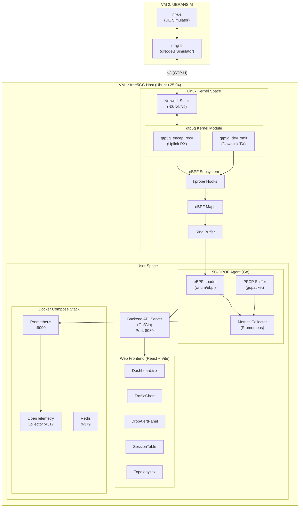
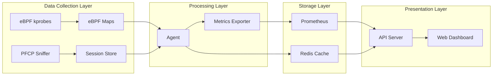
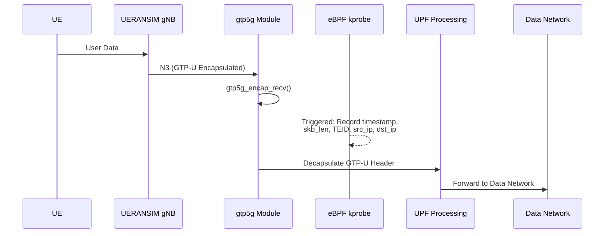
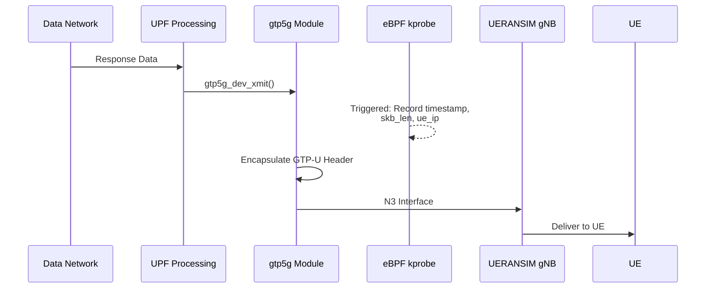
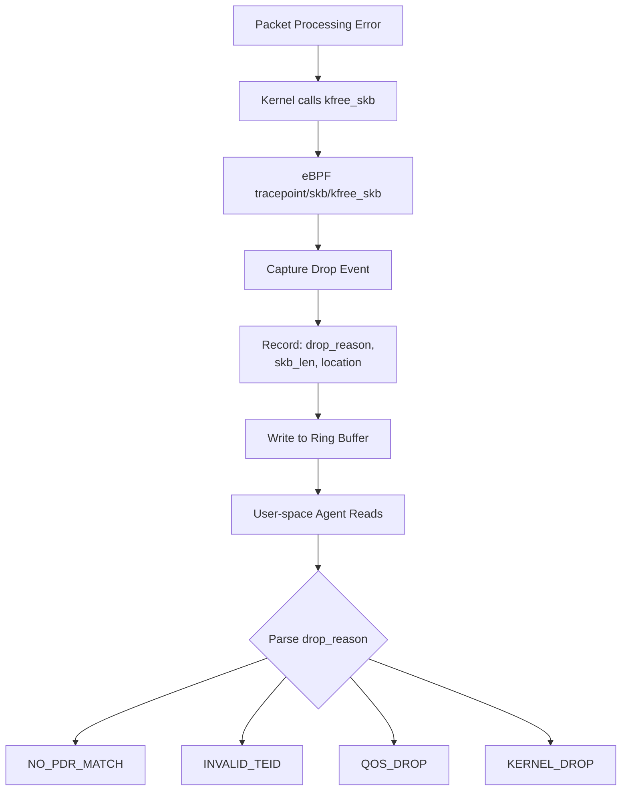

# 5G-DPOP: 5G UPF Data Plane Observability Platform

A non-intrusive 5G Core Network User Plane observability platform based on **eBPF** technology. This project leverages Linux eBPF kprobe mechanisms to directly hook `gtp5g` kernel module functions, enabling real-time traffic monitoring, packet drop detection, and PFCP session correlation analysis for free5GC UPF, without modifying any free5GC or gtp5g source code.

---

## System Architecture

### Architecture Overview

This platform adopts a layered architecture design, consisting of four core layers:



### Component Diagram



### Data Flow Details

#### 1. Uplink Packet Flow (UE → DN)



#### 2. Downlink Packet Flow (DN → UE)



#### 3. Packet Drop Detection Flow



### Component Description

| Component | Technology | Function | Port |
|-----------|------------|----------|------|
| **eBPF Agent** | Go + cilium/ebpf | Load eBPF programs, read kernel maps, export metrics | 9100 (Prometheus) |
| **PFCP Sniffer** | Go + gopacket | Listen to PFCP messages, parse sessions, build TEID mappings | 8805 (listen) |
| **API Server** | Go + Gin | REST API + WebSocket real-time streaming | 8080 |
| **Web Frontend** | React + TypeScript + Vite | Visualization dashboard | 3000 (dev) |
| **Prometheus** | Docker | Time-series database, metrics storage | 9090 |
| **Otel Collector** | Docker | OpenTelemetry collector | 4317 |

---

## Requirements

### Hardware Requirements

| Item | Minimum | Recommended |
|------|---------|-------------|
| CPU | 2 cores | 4+ cores |
| RAM | 4 GB | 8+ GB |
| Disk | 20 GB | 50+ GB SSD |
| Network | 1 Gbps | 1 Gbps |

### Software Requirements

| Software | Version | Description |
|----------|---------|-------------|
| **OS** | Ubuntu 25.04 (Plucky Puffin) | Requires Kernel 6.14+ with BTF support |
| **Linux Kernel** | 6.14.0-36-generic | CONFIG_BPF, CONFIG_BTF must be enabled |
| **Go** | 1.21+ | Compile Agent and API Server |
| **Node.js** | 18+ LTS | Build frontend |
| **Docker** | 24+ | Run Observability Stack |
| **Docker Compose** | v2+ | Container orchestration |
| **Clang/LLVM** | 14+ | Compile eBPF C programs |
| **libbpf** | 1.0+ | eBPF library |
| **bpftool** | Latest | Generate vmlinux.h |

### free5GC Environment

| Component | Version | Status |
|-----------|---------|--------|
| **free5GC** | v4.1.0 | Running in host mode |
| **gtp5g** | Latest | Must be compiled for current kernel |
| **UERANSIM** | Latest | Running on VM2 |

### Verify eBPF Support

Run the following commands to verify eBPF support:

```bash
# Check BTF support
ls -la /sys/kernel/btf/vmlinux

# Check gtp5g module is loaded
lsmod | grep gtp5g

# Verify hookable symbols exist
sudo cat /proc/kallsyms | grep gtp5g_encap_recv
sudo cat /proc/kallsyms | grep gtp5g_dev_xmit
```

Expected output:
```
ffffffffc11a7aa0 t gtp5g_encap_recv     [gtp5g]
ffffffffc11a6420 t gtp5g_dev_xmit       [gtp5g]
```

---

## Usage Guide

### Step 1: Environment Setup

#### 1.1 Install System Dependencies

```bash
# Update package list
sudo apt-get update

# Install build tools and eBPF development dependencies
sudo apt-get install -y \
    build-essential \
    clang \
    llvm \
    libbpf-dev \
    linux-headers-$(uname -r) \
    libelf-dev \
    libpcap-dev \
    pkg-config \
    bpftool \
    bpftrace
```

#### 1.2 Install Go

```bash
# Download Go 1.21+
wget https://go.dev/dl/go1.21.5.linux-amd64.tar.gz

# Extract to /usr/local
sudo rm -rf /usr/local/go
sudo tar -C /usr/local -xzf go1.21.5.linux-amd64.tar.gz

# Set environment variables (add to ~/.bashrc)
echo 'export PATH=$PATH:/usr/local/go/bin' >> ~/.bashrc
echo 'export PATH=$PATH:$(go env GOPATH)/bin' >> ~/.bashrc
source ~/.bashrc

# Verify installation
go version
# Output: go version go1.21.5 linux/amd64
```

#### 1.3 Install Node.js

```bash
# Install Node.js 18 LTS using NodeSource
curl -fsSL https://deb.nodesource.com/setup_18.x | sudo -E bash -
sudo apt-get install -y nodejs

# Verify installation
node -v  # v18.x.x
npm -v   # 9.x.x
```

#### 1.4 Install Docker

```bash
# Install Docker using official script
curl -fsSL https://get.docker.com -o get-docker.sh
sudo sh get-docker.sh

# Add current user to docker group
sudo usermod -aG docker $USER

# Re-login or run
newgrp docker

# Verify installation
docker --version
docker compose version
```

#### 1.5 Verify gtp5g Module

```bash
# If gtp5g is not loaded, compile and load it first
cd ~/gtp5g

# Recompile for current kernel
make clean
make

# Load module
sudo insmod gtp5g.ko

# Verify loaded successfully
lsmod | grep gtp5g
# Output: gtp5g    159744  1
```

---

### Step 2: Build Project

#### 2.1 Get the Project

```bash
cd ~
# Clone the project if not already done
git clone https://github.com/solar224/5G-DPOP.git
cd 5G-DPOP

# If project exists, ensure you're in the correct directory
cd ~/5G-DPOP
```

#### 2.2 Run Environment Setup Script

```bash
# Run one-click setup script (optional, auto-installs all dependencies)
chmod +x scripts/setup_env.sh
./scripts/setup_env.sh
```

#### 2.3 Generate vmlinux.h

```bash
# Generate BTF type definitions from running kernel
sudo bpftool btf dump file /sys/kernel/btf/vmlinux format c > internal/ebpf/bpf/vmlinux.h
```

#### 2.4 Compile eBPF Program

```bash
# Compile eBPF C program to .o file
make ebpf

# Output:
# clang -O2 -g -Wall -target bpf -D__TARGET_ARCH_x86 -c internal/ebpf/bpf/upf_monitor.bpf.c -o internal/ebpf/bpf/upf_monitor.bpf.o
```

#### 2.5 Compile Go Programs

```bash
# Download Go dependencies
make deps

# Build all Go binaries
make build

# Output:
# go build -o bin/agent ./cmd/agent
# go build -o bin/api-server ./cmd/api-server

# Verify build results
ls -la bin/
# -rwxrwxr-x 1 user user 16M Nov 29 10:00 agent
# -rwxrwxr-x 1 user user 13M Nov 29 10:00 api-server
```

#### 2.6 Install Frontend Dependencies

```bash
cd web
npm install
cd ..
```

---

### Step 3: Start Observability Stack

#### 3.1 Start Docker Compose

```bash
# Start Prometheus + Otel Collector + Redis
docker compose -f deployments/docker-compose.yaml up -d

# Check container status
docker compose -f deployments/docker-compose.yaml ps

# Expected output:
# NAME                COMMAND                  SERVICE             STATUS
# prometheus          "/bin/prometheus..."     prometheus          running
# otel-collector      "/otelcol-contrib..."    otel-collector      running
# redis               "docker-entrypoint..."   redis               running
```

#### 3.2 Verify Services

```bash
# Check Prometheus
curl http://localhost:9090/-/healthy
# Output: Prometheus Server is Healthy.

# Check Otel Collector health
curl http://localhost:13133
# Output: {"status":"Server available","upSince":"...","uptime":"..."}
```

---

### Step 4: Start 5G-DPOP Platform

#### 4.1 Start eBPF Agent (Requires Root)

```bash
# Open a new terminal
cd ~/5G-DPOP

# Run Agent with root privileges
sudo ./bin/agent

# Expected output:
# ============================================================
#     5G-DPOP: UPF Data Plane Observability Agent
# ============================================================
# [OK] eBPF programs loaded successfully
# [OK] Event loop started
# [INFO] Prometheus metrics server listening on :9100
# [INFO] Agent is running. Press Ctrl+C to stop.
```

#### 4.2 Verify Agent Operation

```bash
# Check health endpoint
curl http://localhost:9100/health
# Output: OK

# Check Prometheus metrics
curl http://localhost:9100/metrics | grep upf_
# Output:
# upf_packets_total{direction="uplink"} 0
# upf_packets_total{direction="downlink"} 0
# upf_bytes_total{direction="uplink"} 0
# upf_bytes_total{direction="downlink"} 0
# upf_packet_drops_total{reason="KERNEL_DROP"} 0
```

#### 4.3 Start API Server

```bash
# Open another terminal
cd ~/5G-DPOP

# Start API Server
./bin/api-server

# Expected output:
# ============================================================
#     5G-DPOP: Backend API Server
# ============================================================
# [INFO] Starting API server on :8080
```

#### 4.4 Verify API Server

```bash
# Check health endpoint
curl http://localhost:8080/api/v1/health
# Output: {"status":"ok","timestamp":"2025-11-29T10:00:00Z","version":"1.0.0"}

# Get traffic statistics
curl http://localhost:8080/api/v1/metrics/traffic
# Output: {"uplink":{"packets":0,"bytes":0},"downlink":{"packets":0,"bytes":0}}
```

#### 4.5 Start Web Frontend

```bash
# Open another terminal
cd ~/5G-DPOP/web

# Start development server
npm run dev

# Expected output:
#   VITE v5.4.x  ready in xxx ms
#   ➨  Local:   http://localhost:3000/
#   ➨  Network: use --host to expose
```

#### 4.6 Open Browser

Open http://localhost:3000 in your browser to see the 5G-DPOP monitoring dashboard.

> **Note**: The Vite development server is configured in `web/vite.config.ts`, with default port 3000.

---

### Step 5: Generate Test Traffic

#### 5.1 Verify free5GC is Running

```bash
# Check free5GC processes
ps aux | grep -E "(amf|smf|upf|nrf)" | grep -v grep

# Check if UPF is working
curl http://localhost:8000  # NRF API
```

#### 5.2 Generate Traffic with UERANSIM

On VM2 (UERANSIM), execute:

```bash
# Start gNB
cd ~/UERANSIM
./build/nr-gnb -c config/free5gc-gnb.yaml &

# Start UE
./build/nr-ue -c config/free5gc-ue.yaml &

# Wait for PDU Session establishment
sleep 5

# Send ping using UE's tunnel interface
ping -I uesimtun0 8.8.8.8

# Or generate larger traffic
iperf3 -c 8.8.8.8 -B 10.60.0.1 -t 60
```

#### 5.3 Observe Monitoring Data

Return to Web Frontend (http://localhost:3000), you should see:

- **Traffic Chart**: Uplink/Downlink traffic charts showing data
- **Stats Cards**: Packet count and bytes continuously increasing
- **Session Table**: Established PDU Sessions displayed

---

### Step 6: Fault Injection Testing (Optional)

#### 6.1 Trigger Fault Injection via API

```bash
# Send fault injection request
curl -X POST http://localhost:8080/api/v1/fault/inject \
    -H "Content-Type: application/json" \
    -d '{"type":"invalid_teid","target":"upf","count":10}'
```

#### 6.2 Observe Drop Alerts

Return to Web Frontend, you should see new drop events in the **Drop Alert Panel**.

---

### Common Commands

```bash
# One-click start all services (recommended to run in separate terminals)
# Terminal 1: Start Docker Stack
make compose-up

# Terminal 2: Start Agent (requires root)
sudo ./bin/agent
# For free5gc-compose, specify the name of the Docker bridge network.
# sudo ./bin/agent -pfcp-iface br-free5gc

# Terminal 3: Start API Server
./bin/api-server

# Terminal 4: Start Web Frontend
cd web && npm run dev

# Stop all services
pkill -f agent
pkill -f api-server
make compose-down

# View Agent real-time logs
sudo ./bin/agent 2>&1 | tee agent.log

# Clean and rebuild
make clean
make all

# -------------------------------------------------------
# UERANSIM Commands
# Start gNB
./nr-gnb -c ../config/free5gc-gnb.yaml

# Start multiple UEs (e.g., 5 UEs)
sudo ./nr-ue -c ../config/free5gc-ue.yaml -n 5

# Ping from specific UE tunnel
ping -I uesimtun{X} 8.8.8.8

# Ping from all UE tunnels
for i in {0..4}; do ping -I uesimtun$i 8.8.8.8 -c 100 & done
# -------------------------------------------------------


# drop test
# reference:./scripts/drop_tests/README.md
cd ~/drop_tests
sudo bash run_tests.sh
```

---

## Conclusion

5G-DPOP provides a complete 5G UPF data plane observability solution. Its core value lies in:

### Technical Innovation

1. **Non-intrusive Monitoring**: Leveraging Linux eBPF kprobe technology to directly hook key functions in the `gtp5g` kernel module, without modifying any free5GC or gtp5g source code, achieving truly zero-intrusion monitoring.

2. **High Performance, Low Overhead**: Using Per-CPU eBPF Maps to avoid lock contention, and Ring Buffer for asynchronous event delivery, minimizing the performance impact on UPF.

3. **Control/Data Plane Correlation**: Through PFCP Sniffer listening on the N4 interface between SMF and UPF, establishing mappings between SEID (Session Endpoint Identifier) and TEID (Tunnel Endpoint Identifier), enabling packet-level monitoring data to be correlated with specific PDU Sessions and UEs.

### Practical Value

1. **Real-time Visualization**: Custom-built React frontend dashboard providing real-time traffic monitoring, drop alerts, session status, and other critical information visualization, without relying on external tools like Grafana.

2. **Rapid Problem Identification**: When packet drops occur, you can immediately see the drop reason (NO_PDR_MATCH, INVALID_TEID, QOS_DROP, etc.), significantly reducing troubleshooting time.

3. **Validation and Testing**: Built-in fault injection functionality can actively trigger various abnormal scenarios to validate the monitoring platform's effectiveness, and can be used for Chaos Engineering testing.

### Future Roadmap

- Support more eBPF hook points (e.g., QoS processing, PDR/FAR matching)
- Integrate Distributed Tracing (Jaeger/Tempo)
- Support Kubernetes deployment mode
- Add AI/ML anomaly detection capabilities

This project demonstrates the powerful potential of eBPF technology in 5G core network observability, providing new approaches for telecom network monitoring and operations.
